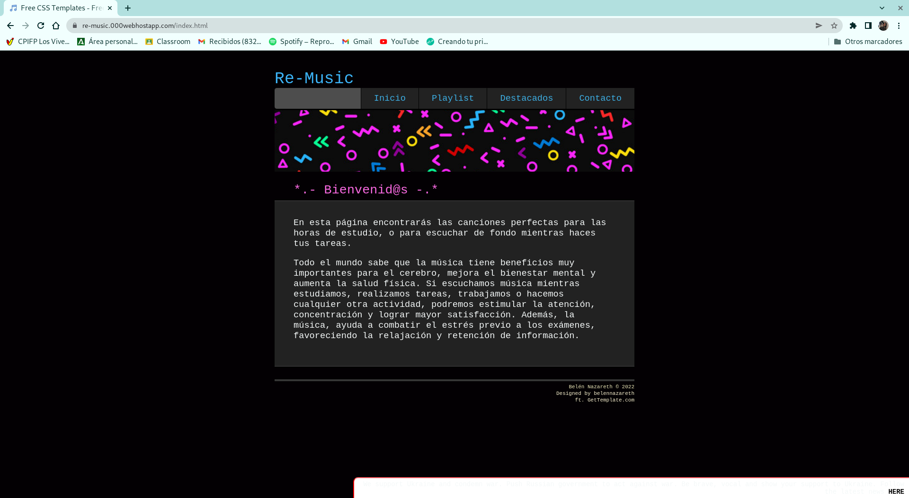
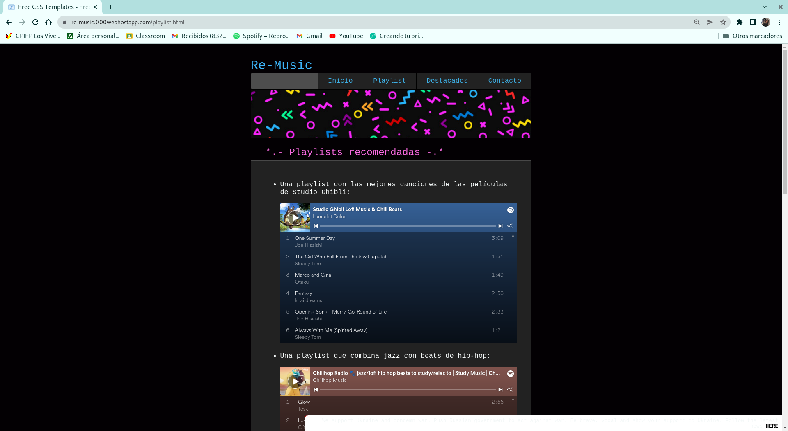
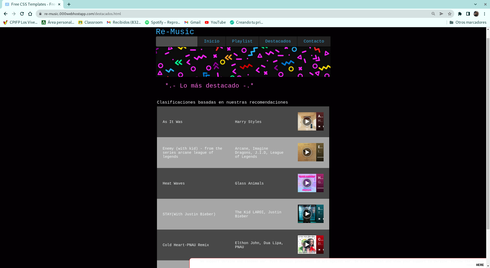
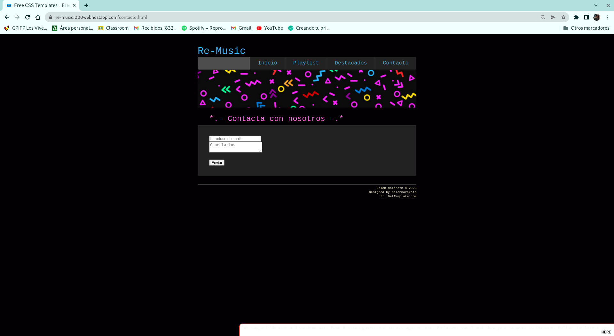
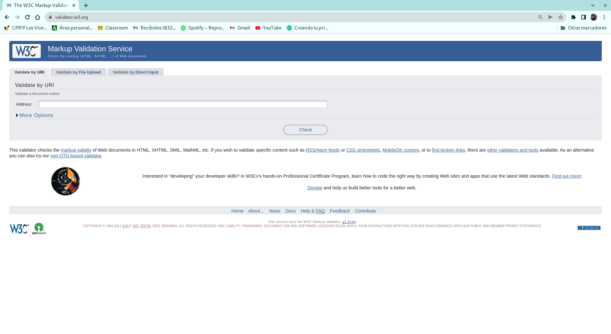
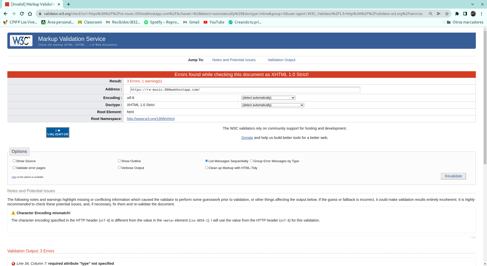
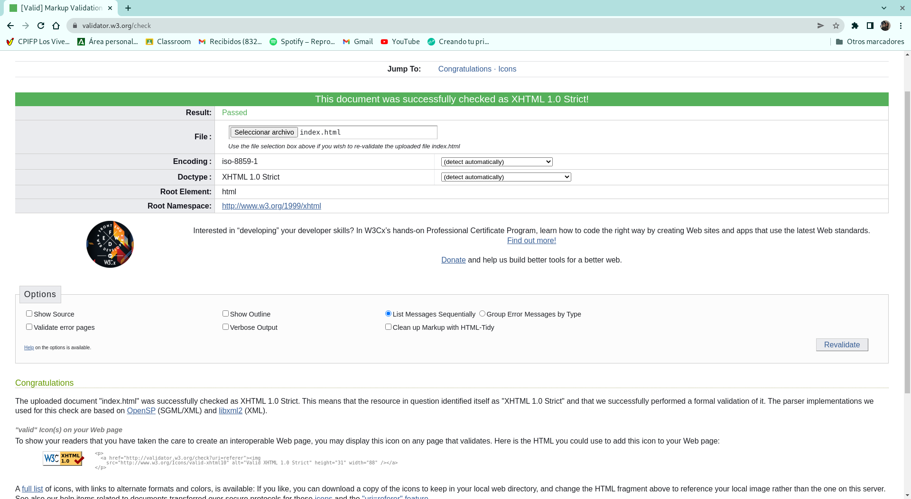

# Proyecto de HTML5 y CSS

## TAREA 2

Para la realización de este HTML he usado una plantilla gratuita de la página: [Plantilla](https://plantillashtmlgratis.com/categoria-plantillas/plantillas-html/page/115/)

## TAREA 3

- Inicio:

- Playlist:

- Destacados:

- Contacto:

## TAREA 4

URL: https://re-music.000webhostapp.com/

## TAREA 5

En este caso voy a hacer uso del hosting 000webhost, usando la opción gratuita nos da una página web y 300MB de espacio:
 [Hosting](https://es.000webhost.com/)

Para poder subir los archivos usaremos filezilla, para instalarlo usaremos el comando:

`apt install filezilla`

Dentro escribiremos el host y las credenciales que nos ofrezca el hosting:

A continuación, alojamos nuestra página en la carpeta public_html.

Entramos a la URL y confirmamos que se encuentra nuestra página:

[URL](https://re-music.000webhostapp.com/)

## TAREA 6

Para validar la página usaremos [W3 Validator](https://validator.w3.org/):

Al validar la URL en el host nos da una serie de errores de código introducido por parte de la página del hosting:

Sin embargo si validamos el fichero fuera del host podemos comprobar que la validación es correcta:

